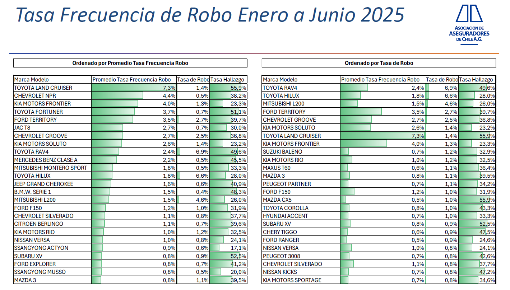

::: {.callout-note icon="true"}
## Resumen

Este *informe automatizado* desarrolla un análisis exploratorio de datos (AED) de las Marcas-Modelo más robadas en el último trimestre, con base en información de la lista de **bloqueados** y **agravados** del análisis anterior, junto con la lista proporcionada por el informe trimestral de la AACH. La finalidad está en detallar y justificar cualquier modificación necesaria para Bloquear o Monitorear la suscripción de estas clases de vehículos.
:::

# Contexto del informe

Este informe analiza los registros de la base de datos `Motor_personal_final` del último trimestre para actualizar la lista de marcas-modelo **bloqueadas** y **monitoreadas** por SURA a raíz de su alta siniestralidad y cantidad de robos. LA lista de marcas.modelo de interés se obtiene de las 2 tablas siguientes:




A partir de esto, el informe pasa por una serie de procesos automatizados hasta generar el nuevo excel con la lista actualizada.

```{python}
#| label: imports-config
#| echo: false
#| warning: false
#| error: false
#| cache: false          # Activa el cache de celdas
#| freeze: auto         # Evita re-renderizar si no hubo cambios globales

from __future__ import annotations

import base64
from IPython.utils.capture import capture_output
import math
import re
import sys
from typing import Any, List, Dict, Optional, Sequence, Union, Tuple

import io
from io import StringIO

from openpyxl import Workbook
from openpyxl.styles import Font, PatternFill, Alignment, Border, Side
from openpyxl.styles.colors import Color
from openpyxl.utils import get_column_letter
from datetime import datetime
import zipfile, shutil, os

import numpy as np
import polars as pl
import pandas as pd  # Solo para compatibilidad con Plotly
from pyspark.sql import SparkSession
import pyodbc
from pathlib import Path

# print(pyodbc.drivers()) # Comprobar Drivers

# Configuración de parámetros (equivalente a params en R)
# Nota: En Python/Quarto, los params del YAML no están disponibles automáticamente
PARAMS = {
    #'titulo_reporte': 'Análisis de Datos',
    #'seed': 42,
    #'n_muestras': 100,
    'mostrar_codigo': False,
    'color_grafico': 'blue'
}

# Forzar modo offline para Plotly (evita descargas de CDN)
import plotly.offline as py_offline
import plotly.io as pio
import plotly.graph_objects as go
from plotly.subplots import make_subplots
from scipy import stats as sp_stats

pio.renderers.default = "notebook" # o "iframe" / "browser" dependiendo de lo que Quarto prefiera, pero para HTML estático:
# Quarto maneja plotly automágicamente, pero esto ayuda a veces:
py_offline.init_notebook_mode(connected=False)

# Configuración necesaria para PrettyTibble
from IPython.display import HTML, display

# Configuración de reproducibilidad
SEED = PARAMS.get('seed', None)  # devuelve None si no existe 'seed'

```

```{python}
#| label: prettytable
#| echo: false
#| warning: false
#| error: false
#| cache: false          # Activa el cache de celdas
#| freeze: auto         # Evita re-renderizar si no hubo cambios globales

def pretty_table(
    data: Any,
    n: int = 10,
    show_types: bool = True,
    color_scheme: Optional[Dict[str, str]] = None,
    title_color: str = "#2C3E50",
    header_color: str = "#34495E",
    stripe_color: str = "#F8F9FA",
    hover_color: str = "#E8F4F8",
    enable_download: bool = True,
    filename_base: str = "tabla",
    # para pintar categóricas
    highlight_col: Optional[str] = None,
    highlight_palette: Optional[Dict[str, str]] = None,
    highlight_cols: Optional[List[str]] = None,
    highlight_cols_palette: Optional[Dict[str, str]] = None,
    title: Optional[str] = None,
) -> None:
    """
    Muestra un DataFrame con estilo visual tipo tibble de R y,
    opcionalmente, agrega botones para descargar los datos en CSV, Excel, HTML o parquet.

    Soporta: Polars DataFrame, PySpark DataFrame, Pandas DataFrame.
    """
    
    # Esquema de colores por defecto
    if color_scheme is None:
        color_scheme = {
            "str": "#FF6B6B",       # Rojo para string/character
            "object": "#FF6B6B",    # Pandas object -> string
            "Utf8": "#FF6B6B",      # Polars string
            "String": "#FF6B6B",    # Polars/Spark string
            "string": "#FF6B6B",    # Spark string type
            "float": "#4ECDC4",     # Turquesa para float/double
            "float64": "#4ECDC4",
            "float32": "#4ECDC4",
            "Float64": "#4ECDC4",   # Polars
            "Float32": "#4ECDC4",
            "double": "#4ECDC4",    # Spark
            "int": "#45B7D1",       # Azul para integer
            "int64": "#45B7D1",
            "int32": "#45B7D1",
            "Int64": "#45B7D1",     # Polars
            "Int32": "#45B7D1",
            "long": "#45B7D1",      # Spark
            "integer": "#45B7D1",
            "bool": "#96CEB4",      # Verde para boolean/logical
            "Boolean": "#96CEB4",   # Polars
            "boolean": "#96CEB4",   # Spark
            "date": "#DDA15E",      # Naranja para date
            "Date": "#DDA15E",      # Polars
            "datetime": "#DDA15E",
            "Datetime": "#DDA15E",  # Polars
            "timestamp": "#DDA15E", # Spark
            "category": "#FFEAA7",  # Amarillo para factor/category
            "Categorical": "#FFEAA7", # Polars
            "default": "#95A5A6"    # Gris para otros
        }
    
    # Detectar tipo de DataFrame y convertir a Pandas
    df_type = type(data).__name__
    module_name = type(data).__module__
    original_types = {}
    
    if "polars" in module_name.lower():
        # Polars DataFrame
        original_types = {col: str(dtype) for col, dtype in zip(data.columns, data.dtypes)}
        n_rows = data.height
        n_cols = data.width
        col_names = data.columns
        df_pandas = data.head(n).to_pandas()
        source_lib = "Polars"
        
    elif "pyspark" in module_name.lower():
        # PySpark DataFrame
        schema = data.schema
        original_types = {
            field.name: str(field.dataType).replace("Type()", "") 
            for field in schema.fields
        }
        n_rows = data.count()
        n_cols = len(schema.fields)
        col_names = data.columns
        df_pandas = data.limit(n).toPandas()
        source_lib = "Spark"
        
    elif "pandas" in module_name.lower() or df_type == "DataFrame":
        # Pandas DataFrame
        original_types = {col: str(dtype) for col, dtype in data.dtypes.items()}
        n_rows = len(data)
        n_cols = len(data.columns)
        col_names = list(data.columns)
        df_pandas = data.head(n)
        source_lib = "Pandas"
        
    else:
        raise TypeError(
            f"Tipo de DataFrame no soportado: {df_type}. "
            "Use Polars, PySpark o Pandas."
        )
    
    rows_hidden = max(0, n_rows - n)
    
    rows_hidden = max(0, n_rows - n)

    # =========================
    # Coloreado por fila
    # =========================
    row_color_map: Dict[str, str] = {}

    if highlight_col is not None and highlight_col in df_pandas.columns:
        # Lista base de colores suaves (pasteles) para las filas
        base_row_colors = [
            "#FFF5F5",  # rojo muy suave
            "#FFF9E6",  # amarillo muy suave
            "#F5FFF5",  # verde muy suave
            "#E6F6FF",  # azul muy suave
            "#F9F2FF",  # violeta muy suave
            "#FFEFF7",  # rosado muy suave
        ]

        # Valores únicos de la columna usada para resaltar
        unique_vals = [
            str(v)
            for v in df_pandas[highlight_col].dropna().unique()
        ]

        for i, val in enumerate(unique_vals):
            if highlight_palette and val in highlight_palette:
                # Si el usuario entrega un color para ese valor, se respeta
                row_color_map[val] = highlight_palette[val]
            else:
                # Asignar un color de la paleta base, ciclando si hay más categorías que colores
                row_color_map[val] = base_row_colors[i % len(base_row_colors)]
    
    # =========================
    # Coloreado por columna
    # =========================
    col_color_map: Dict[str, str] = {}

    if highlight_cols:
        # Paleta base para columnas (puedes cambiarla si quieres otra estética)
        base_col_colors = [
            "#55A868",  # verde
            "#8172B3",  # morado
            "#DD8452",  # naranja
            "#C44E52",  # rojo
            "#4C72B0",  # azul
        ]

        for i, col in enumerate(highlight_cols):
            if highlight_cols_palette and col in highlight_cols_palette:
                # Si el usuario pasa un color específico para esa columna
                col_color_map[col] = highlight_cols_palette[col]
            else:
                # Color de la paleta base, ciclando si hay más columnas que colores
                col_color_map[col] = base_col_colors[i % len(base_col_colors)]

    # Función auxiliar para obtener color de fondo de la fila
    def get_row_bg_color(row_value: Any) -> str:
        if pd.isna(row_value):
            return ""
        key = str(row_value)
        # Priorizar palette personalizada si viene
        if highlight_palette and key in highlight_palette:
            return highlight_palette[key]
        return row_color_map.get(key, "")
    
    # ---------------------------------------------

    # Función auxiliar para obtener color según tipo
    def get_type_color(type_str: str) -> str:
        if type_str in color_scheme:
            return color_scheme[type_str]
        
        type_lower = type_str.lower()
        for key, color in color_scheme.items():
            if key.lower() in type_lower or type_lower in key.lower():
                return color
        
        return color_scheme.get("default", "#95A5A6")
    
    # ID único para la tabla
    table_id = f"pretty-table-{id(data)}"
    
    # ---- CSS Tabla + Botones ----
    css = f"""
    <style>
    #{table_id} {{
        font-family: 'Segoe UI', Tahoma, Geneva, Verdana, sans-serif;
        font-size: 13px;
        border-collapse: collapse;
        margin: 1em 0;
        box-shadow: 0 2px 8px rgba(0,0,0,0.1);
        border-radius: 8px;
        overflow: hidden;
    }}
    #{table_id} .title-row {{
        background-color: {title_color};
        color: white;
        font-weight: bold;
        font-size: 14px;
        text-align: left;
        padding: 12px 16px;
    }}
    /* Estilos para título y subtítulo */
    #{table_id} .main-title {{
        font-size: 15px;
        font-weight: 600;
        margin-right: 10px;
    }}
    #{table_id} .subtitle {{
        font-size: 12px;
        font-weight: 400;
        opacity: 0.9;
    }}
    #{table_id} .title-row .source-badge {{
        background-color: rgba(255,255,255,0.2);
        padding: 2px 8px;
        border-radius: 4px;
        font-size: 11px;
        margin-left: 10px;
    }}
    #{table_id} th {{
        background-color: {header_color};
        color: white;
        padding: 10px 12px;
        text-align: left;
        border-right: 1px solid rgba(255,255,255,0.1);
        vertical-align: bottom;
    }}
    #{table_id} th:last-child {{
        border-right: none;
    }}
    #{table_id} .col-name {{
        font-weight: bold;
        margin-bottom: 4px;
    }}
    #{table_id} .type-badge {{
        display: inline-block;
        padding: 2px 8px;
        border-radius: 3px;
        font-size: 10px;
        font-weight: bold;
        color: white;
    }}
    #{table_id} tbody tr {{
        background-color: #FFFFFF;
        color: #2C3E50;
    }}
    #{table_id} tr:nth-child(even) {{
        background-color: {stripe_color};
    }}
    #{table_id} td {{
        padding: 8px 12px;
        border-right: 1px solid #ECF0F1;
        border-bottom: 1px solid #ECF0F1;
        color: #2C3E50;
    }}
    #{table_id} td:last-child {{
        border-right: none;
    }}
    #{table_id} tbody tr:hover {{
        background-color: {hover_color};
    }}
    #{table_id} .footer-row {{
        background-color: #F8F9FA;
        color: #7F8C8D;
        font-style: italic;
        font-size: 12px;
        padding: 8px 16px;
        text-align: left;
        border-top: 2px solid #ECF0F1;
    }}

    /* Contenedor y estilo de botones de descarga */
    #{table_id}-downloads {{
        margin: 0.5em 0 0.2em 0;
        font-family: 'Segoe UI', Tahoma, Geneva, Verdana, sans-serif;
        font-size: 11px;
        color: #7F8C8D;
    }}
    #{table_id}-downloads .download-btn {{
        background: none;
        border: none;
        padding: 0;
        margin-right: 6px;
        font-size: 11px;
        color: #7F8C8D !important;
        text-decoration: none;
        cursor: pointer;
    }}
    #{table_id}-downloads .download-btn:hover {{
        color: #2C3E50 !important;
        text-decoration: underline;
    }}
    </style>
    """
    
    # Encabezado de título
    dim_text = f"- Pseudo-tibble: {n_rows:,} × {n_cols}"
    if title is not None and str(title).strip() != "":
        # Con título: mostramos título principal y subtítulo
        title_html = f"""
        <tr>
            <td colspan="{n_cols}" class="title-row">
                <span class="main-title">{title}</span>
                <span class="subtitle">{dim_text}</span>
                <span class="source-badge">{source_lib}</span>
            </td>
        </tr>
        """
    else:
        # Sin título: comportamiento anterior
        title_html = f"""
        <tr>
            <td colspan="{n_cols}" class="title-row">
                {dim_text}
                <span class="source-badge">{source_lib}</span>
            </td>
        </tr>
        """
    
    # Encabezados de columna con tipos
    headers_html = "<tr>"
    for col in col_names:
        type_str = original_types.get(col, "unknown")
        type_color = get_type_color(type_str)
        
        type_display = type_str.split(".")[-1]
        if len(type_display) > 12:
            type_display = type_display[:10] + "…"
        
        if show_types:
            headers_html += f"""
            <th>
                <div class="col-name">{col}</div>
                <span class="type-badge" style="background-color: {type_color};">
                    &lt;{type_display}&gt;
                </span>
            </th>
            """
        else:
            headers_html += f"<th><div class='col-name'>{col}</div></th>"
    headers_html += "</tr>"
    
    # Filas de datos
    rows_html = ""
    for idx, row in df_pandas.iterrows():
        # Estilo potencial de la fila (por highlight_col)
        row_style = ""
        if highlight_col is not None and highlight_col in df_pandas.columns:
            bg_color = get_row_bg_color(row[highlight_col])
            if bg_color:
                row_style = f' style="background-color: {bg_color};"'

        rows_html += f"<tr{row_style}>"

        for col in col_names:
            val = row[col]

            # --- formateo del contenido (igual que antes) ---
            if pd.isna(val):
                cell_content = "<span style='color:#BDC3C7;'>NA</span>"
            elif isinstance(val, float):
                cell_content = f"{val:.4g}"
            else:
                cell_content = str(val)
                if len(cell_content) > 50:
                    cell_content = cell_content[:47] + "…"

            # --- 🔹 PRIORIDAD: color por COLUMNA ---
            cell_style = ""
            if col in col_color_map:
                # si la columna está marcada, este color manda
                cell_style = f' style="background-color: {col_color_map[col]};"'

            rows_html += f"<td{cell_style}>{cell_content}</td>"

        rows_html += "</tr>"

    
    # Pie de página
    if rows_hidden > 0:
        footer_text = f"- … {rows_hidden:,} filas sin mostrar"
    else:
        footer_text = "- Mostrando todas las filas"
    
    footer_html = f"""
    <tr>
        <td colspan="{n_cols}" class="footer-row">
            {footer_text}
        </td>
    </tr>
    """

    # ------- HTML de la tabla (sin botones) - reutilizable -
    table_html = f"""
    <table id="{table_id}">
        <thead>
            {title_html}
            {headers_html}
        </thead>
        <tbody>
            {rows_html}
        </tbody>
        <tfoot>
            {footer_html}
        </tfoot>
    </table>
    """

    # --------- Botones de descarga ----------

    downloads_html = ""
    if enable_download:
        # CSV
        csv_str = df_pandas.to_csv(index=False)
        b64_csv = base64.b64encode(csv_str.encode("utf-8")).decode("utf-8")
        
        # HTML CON MISMO ESTILO QUE LA VISTA                         # <<<
        # Documento HTML completo (standalone)
        html_document = f"""
        <!DOCTYPE html>
        <html lang="es">
        <head>
            <meta charset="utf-8">
            <title>{filename_base}</title>
            {css}
        </head>
        <body>
            {table_html}
        </body>
        </html>
        """
        b64_html = base64.b64encode(html_document.encode("utf-8")).decode("utf-8")

        # Excel
        excel_buffer = io.BytesIO()
        df_pandas.to_excel(excel_buffer, index=False, engine="openpyxl")
        excel_buffer.seek(0)
        b64_excel = base64.b64encode(excel_buffer.read()).decode("utf-8")

        # Parquet
        parquet_buffer = io.BytesIO()
        df_pandas.to_parquet(parquet_buffer, index=False, engine="pyarrow")
        parquet_buffer.seek(0)
        b64_parquet = base64.b64encode(parquet_buffer.read()).decode("utf-8")
        
        downloads_html = f"""
        <div id="{table_id}-downloads">
            <a class="download-btn" 
               download="{filename_base}.csv" 
               href="data:text/csv;base64,{b64_csv}">
               Descargar CSV
            </a>
            <a class="download-btn" 
               download="{filename_base}.xlsx" 
               href="data:application/vnd.openxmlformats-officedocument.spreadsheetml.sheet;base64,{b64_excel}">
               Descargar Excel
            </a>
            <a class="download-btn" 
               download="{filename_base}.html" 
               href="data:text/html;base64,{b64_html}">
               Descargar HTML
            </a>
            <a class="download-btn" 
               download="{filename_base}.parquet" 
               href="data:application/octet-stream;base64,{b64_parquet}">
               Descargar Parquet
            </a>
        </div>
        """

    # ================================================================
    # Modo estático (comportamiento por defecto)
    # ================================================================
    full_html = f"""
    {css}
    {downloads_html}
    {table_html}
    """
    
    display(HTML(full_html))
```

```{python}
#| label: Crear Dashboard univariado
#| echo: false
#| warning: false
#| error: false
#| cache: false          # Activa el cache de celdas
#| freeze: auto         # Evita re-renderizar si no hubo cambios globales

# import pandas as pd
# import numpy as np
# import plotly.graph_objects as go
# from plotly.subplots import make_subplots
# from scipy import stats as sp_stats

def boxhist_interactivo(
    data: pd.DataFrame,
    titulo: str = "Análisis Univariado",
    color_var: str = None,
    height: int = 650,
    width: int = 1050,
    nbins: int = None
) -> go.Figure:
    """
    Crea un dashboard interactivo con histograma superpuesto (en realidad barras),
    boxplot y tabla de estadísticas enriquecidas. Permite separar los datos por
    colores según una variable categórica.

    IMPORTANTE:
    -----------
    Cuando se separa por categorías, las alturas de los histogramas se calculan
    en proporción al total (N_total), de forma que el histograma desagregado
    apilado coincide exactamente con el histograma total.
    """

    # 1. Identificar columnas numéricas ─────────────────────────────────────
    numeric_cols = data.select_dtypes(include=['number']).columns.tolist()
    if color_var and color_var in numeric_cols:
        numeric_cols.remove(color_var)

    if not numeric_cols:
        raise ValueError("El DataFrame no contiene columnas numéricas.")

    # 2. Configurar categorías y colores ────────────────────────────────────
    if color_var:
        if color_var not in data.columns:
            raise ValueError(f"La variable '{color_var}' no existe en el DataFrame.")
        categorias = data[color_var].dropna().unique().tolist()
        show_legend = True
    else:
        categorias = ['Todo']
        show_legend = False

    # Paleta extendida (10 colores)
    colores = [
        '#4E79A7', '#F28E2B', '#76B7B2', '#EDC949', '#B07AA1',
        '#FF9DA7', '#9C755F', '#BAB0AC', '#D37295', '#FABFD2'
    ]

    # 3. Función de estadísticas enriquecidas ───────────────────────────────
    def calc_stats(vec: pd.Series) -> pd.DataFrame:
        """Calcula estadísticas descriptivas completas."""
        vec = vec.dropna()
        n = len(vec)
        q1, q3 = vec.quantile([0.25, 0.75])
        iqr = q3 - q1
        n_outliers = int(((vec < q1 - 1.5 * iqr) | (vec > q3 + 1.5 * iqr)).sum())
        mean_val = vec.mean()
        std_val = vec.std()
        cv_pct = round((std_val / mean_val) * 100, 2) if mean_val != 0 else np.nan
        skew_val = round(vec.skew(), 2)
        kurt_val = round(vec.kurtosis(), 2)

        # Test de normalidad (Shapiro para n <= 5000, D'Agostino-Pearson si no)
        if n >= 8:
            if n <= 5000:
                _, p_norm = sp_stats.shapiro(vec)
            else:
                _, p_norm = sp_stats.normaltest(vec)
            p_norm = round(p_norm, 4)
        else:
            p_norm = 'N/A'

        metricas = ['N', 'Media', 'Mediana', 'Desv. Est.', 'CV %',
                    'Mínimo', 'Q1', 'Q3', 'Máximo', 'Asimetría',
                    'Curtosis', 'Atípicos', 'p Normalidad']
        valores = [n, round(mean_val, 2), round(vec.median(), 2), round(std_val, 2),
                   cv_pct, round(vec.min(), 2), round(q1, 2), round(q3, 2),
                   round(vec.max(), 2), skew_val, kurt_val, n_outliers, p_norm]

        return pd.DataFrame({'Métrica': metricas, 'Valor': valores})

    # 4. Líneas verticales de Media y Mediana ───────────────────────────────
    def get_shapes(var_data_full):
        mean_val = var_data_full.mean()
        median_val = var_data_full.median()
        return [
            dict(type='line', x0=mean_val, x1=mean_val, y0=0, y1=1,
                 xref='x', yref='y domain',
                 line=dict(color='#D62728', dash='dash', width=2)),
            dict(type='line', x0=median_val, x1=median_val, y0=0, y1=1,
                 xref='x', yref='y domain',
                 line=dict(color='#2CA02C', dash='solid', width=2)),
        ]

    # 5. Número de bins por defecto (Freedman-Diaconis) ─────────────────────
    def fd_bins(vec):
        """Calcula bins óptimos con la regla de Freedman-Diaconis."""
        vec = vec.dropna()
        n = len(vec)
        if n < 2:
            return 10
        q1, q3 = vec.quantile([0.25, 0.75])
        iqr = q3 - q1
        if iqr == 0:
            return max(10, int(np.sqrt(n)))
        bin_width = 2 * iqr * n ** (-1/3)
        n_bins = int(np.ceil((vec.max() - vec.min()) / bin_width))
        return max(5, min(n_bins, 200))  # Clamp entre 5 y 200

    # 7. Crear figura con subplots ─────────────────────────────────────────
    fig = make_subplots(
        rows=2, cols=2,
        row_heights=[0.7, 0.3],
        column_widths=[0.6, 0.4],
        specs=[
            [{"type": "bar"}, {"type": "table", "rowspan": 2}],  # ← bar en vez de histogram
            [{"type": "box"}, None]
        ],
        vertical_spacing=0.06,
        horizontal_spacing=0.08,
        subplot_titles=("Distribución", "Estadísticas Descriptivas", "")
    )

    # Variable inicial
    first_var = numeric_cols[0]
    first_data_full = data[first_var].dropna()
    first_stats = calc_stats(first_data_full)

    # Cálculo de bins y densidades proporcionales al total ─────────────────
    auto_bins = nbins or fd_bins(first_data_full)
    N_total_first = len(first_data_full)

    # Bordes y centros de bins comunes a TODAS las categorías
    counts_total, bin_edges_first = np.histogram(first_data_full, bins=auto_bins)
    bin_widths_first = np.diff(bin_edges_first)
    bin_centers_first = bin_edges_first[:-1] + bin_widths_first / 2

    # 8. Añadir trazos (histograma como barras + boxplot) ───────────────────
    for i, cat in enumerate(categorias):
        color = colores[i % len(colores)]
        cat_name = str(cat) if color_var else 'Distribución'
        cat_data = (data[data[color_var] == cat][first_var].dropna()
                    if color_var else first_data_full)

        # --- CAMBIO CLAVE: histograma manual y densidad relativa al TOTAL ---
        counts_cat, _ = np.histogram(cat_data, bins=bin_edges_first)
        # densidad = n_cat_bin / (N_total * ancho_bin)
        density_cat = counts_cat / (N_total_first * bin_widths_first)

        # Histogramas como barras apiladas
        fig.add_trace(go.Bar(
            x=bin_centers_first,
            y=density_cat,
            marker_color=color,
            opacity=0.85,
            name=cat_name,
            showlegend=show_legend,
            legendgroup=cat_name
        ), row=1, col=1)

        # Boxplot
        fig.add_trace(go.Box(
            x=cat_data, orientation='h', boxpoints='outliers',
            marker_color=color, boxmean=True,
            name=cat_name, showlegend=False, legendgroup=cat_name
        ), row=2, col=1)

    # Tabla de estadísticas ─────────────────────────────────────────────────
    n_metricas = len(first_stats)
    cell_colors = [['#F8F9FA'] * n_metricas, ['#F8F9FA'] * n_metricas]
    p_idx = first_stats['Métrica'].tolist().index('p Normalidad')
    p_val = first_stats['Valor'].iloc[p_idx]
    if isinstance(p_val, (int, float)) and p_val < 0.05:
        cell_colors[1][p_idx] = '#FFEEBA'  # Amarillo si rechaza normalidad

    fig.add_trace(go.Table(
        header=dict(
            values=['<b>Métrica</b>', '<b>Valor</b>'],
            fill_color='#4E79A7',
            font=dict(color='white', size=12),
            align='left', height=30
        ),
        cells=dict(
            values=[first_stats['Métrica'], first_stats['Valor']],
            fill_color=cell_colors,
            font=dict(size=11),
            align='left', height=26
        )
    ), row=1, col=2)

    # 9. Botones del menú desplegable ──────────────────────────────────────
    buttons = []
    table_index = len(categorias) * 2  # Bar + Box por categoría

    for var in numeric_cols:
        var_data_full = data[var].dropna()
        var_stats = calc_stats(var_data_full)

        # Bins y densidades para ESTA variable
        var_bins = nbins or fd_bins(var_data_full)
        N_total_var = len(var_data_full)
        counts_total_var, bin_edges_var = np.histogram(var_data_full, bins=var_bins)
        bin_widths_var = np.diff(bin_edges_var)
        bin_centers_var = bin_edges_var[:-1] + bin_widths_var / 2

        trace_x = []
        trace_y = []

        for cat in categorias:
            cat_data = (data[data[color_var] == cat][var].dropna()
                        if color_var else var_data_full)

            # Histograma por categoría con la MISMA base N_total_var
            counts_cat, _ = np.histogram(cat_data, bins=bin_edges_var)
            density_cat = counts_cat / (N_total_var * bin_widths_var)

            # Hist (Bar)
            trace_x.append(bin_centers_var)
            trace_y.append(density_cat)

            # Box
            trace_x.append(cat_data)
            trace_y.append(None)  # no usamos y en el boxplot (orientación 'h')

        # Tabla (sin datos de x/y)
        trace_x.append(None)
        trace_y.append(None)

        # Colores de celda para esta variable
        p_val_var = var_stats['Valor'].iloc[p_idx]
        cell_c = [['#F8F9FA'] * n_metricas, ['#F8F9FA'] * n_metricas]
        if isinstance(p_val_var, (int, float)) and p_val_var < 0.05:
            cell_c[1][p_idx] = '#FFEEBA'

        buttons.append(dict(
            method='update', label=var,
            args=[
                {
                    # Actualizamos x/y de TODAS las trazas (bars + boxes + tabla)
                    'x': trace_x,
                    'y': trace_y,
                    'cells.values': (
                        [None] * table_index
                        + [[var_stats['Métrica'].tolist(), var_stats['Valor'].tolist()]]
                    ),
                    'cells.fill.color': (
                        [None] * table_index + [cell_c]
                    ),
                },
                {
                    'xaxis.title.text': var,
                    'xaxis2.title.text': var,
                    'shapes': get_shapes(var_data_full),
                }
            ]
        ))

    # 10. Layout final ─────────────────────────────────────────────────────
    fig.update_layout(
        title=dict(
            text=f'<b>{titulo}</b>',
            font=dict(size=20, family='Arial'),
            x=0.5, y=0.97
        ),
        barmode='stack',  # apilamos categorías
        shapes=get_shapes(first_data_full),
        height=height, width=width,
        margin=dict(t=100, l=60, r=40, b=60),
        xaxis=dict(title=dict(text=first_var)),
        legend=dict(
            orientation='v', yanchor='top', y=1.0,
            xanchor='left', x=1.02,
            font=dict(size=11)
        ),
        updatemenus=[dict(
            type='dropdown', x=0.0, y=1.12,
            xanchor='left', yanchor='top',
            buttons=buttons,
            bgcolor='white', bordercolor='#4E79A7', borderwidth=1,
            font=dict(size=12),
            pad=dict(r=10, t=5)
        )]
    )

    # Alinear ejes X: boxplot comparte rango con histograma
    fig.update_xaxes(matches='x', row=2, col=1)
    fig.update_yaxes(title_text='', row=2, col=1)

    return fig
```

# Métricas de siniestros más robados

Tabla de análisis de métricas de siniestros para las marcas-modelo más robados. (`LR`, `Frec` y `Promedio Tasa Frecuencia Robo (AACH)` están en porcentaje).

-   **Azul**: Actualmente bloqueada.
-   **Roja**: Actualmente monitoreada.
-   **Amarilla**: Solo destacada en el informe de la AACH.

```{python}
#| label: Dataframe
#| echo: false
#| warning: false
#| error: false
#| cache: false          # Activa el cache de celdas
#| freeze: auto         # Evita re-renderizar si no hubo cambios globales

df_robos = pl.read_parquet("df_robos.parquet")

df_robos_ordenado = (
    df_robos
    .with_columns(
        pl.when(pl.col("ESTADO SUSCRIPCION") == "BLOQUEADA").then(0)
        .when(pl.col("ESTADO SUSCRIPCION") == "MONITOREADA").then(1)
        .when(pl.col("ESTADO SUSCRIPCION") == "AACH").then(2)
        .otherwise(999)                     # por ejemplo, otros estados al final
        .alias("orden_prop")
    )
    .sort("orden_prop")
    .drop("orden_prop")
)

paleta_robos = {
    "MONITOREADA": "#FF9494",
    "BLOQUEADA": "#94B6FF",
    "AACH": "#FFDF94",
}

LR = ["LR_Robo", "LR_DP", "LR_PT", "LR_RC", "LR_TOTAL"]

pretty_table(df_robos_ordenado,
            n=100,
            highlight_col="ESTADO SUSCRIPCION",
            highlight_palette=paleta_robos,
            highlight_cols=LR,
            title="Tabla de marcas-modelo más robados (colores por estado suscripción actual)"
            )

```

```{python}
#| label: Dashboard-robos
#| echo: false
#| warning: false
#| error: false
#| cache: false          # Activa el cache de celdas
#| freeze: auto         # Evita re-renderizar si no hubo cambios globales

df_panda = df_robos.to_pandas()

# ---- Generar gráfico interactivo ----
fig_interactivo = boxhist_interactivo(
    df_panda, 
    titulo="Características univariadas de la Tabla de más robados"
)

fig_interactivo.show()
```

```{python}
#| label: dashboard-robos-desagregado
#| echo: false
#| warning: false
#| error: false
#| cache: false          # Activa el cache de celdas
#| freeze: auto         # Evita re-renderizar si no hubo cambios globales

# ---- Generar gráfico interactivo ----
fig_interactivo_desagregado = boxhist_interactivo(
    df_panda, 
    titulo="Características univariadas de la Tabla de más robados (desagregada por tipo de siniestro)",
    color_var="ESTADO SUSCRIPCION"
)

fig_interactivo_desagregado.show()
```

# Tabla de resultados sugeridos según criterios automáticos.

Muestra la tabla de resultados sugeridos según análisis de métricas de siniestros **automatizada** para las marcas-modelo más robados. (`LR`, `Frec` y `Promedio Tasa Frecuencia Robo (AACH)` están en porcentaje).

-   **Azul**: Bloquear.
-   **Roja**: Monitorear.
-   **Verde**: Sacar de la lista.

::: {.callout-caution collapse="true"}
## Criterios de selección automatizados

Los criterios van en flujo **Bloquear \> Monitorear \> sacar**. Es decir, solo se saca si no se debe monitorear o bloquear y solo se monitorea si no se debe bloquear.

| Categoría | Condición |
|---------------------------|---------------------------------------------|
| **Bloquear** | Cumple **al menos uno**: |
|  | \- Promedio Tasa Frecuencia Robo (AACH) **\>= 2,5** |
|  | \- **LR_TOTAL \>= 75** |
|  | \- Categoría **Bloqueos estratégicos** |
| **Monitorear** | Cumple **al menos uno** (solo si NO cumple criterios de Bloquear): |
|  | \- Promedio Tasa Frecuencia Robo (AACH) **\>= 1,5** |
|  | \- **65 \<= LR_TOTAL \< 75** |
| **Salir** | Debe cumplir **ambos** (solo si NO cumple criterios anteriores): |
|  | \- Promedio Tasa Frecuencia Robo (AACH) **\< 1,5** |
|  | \- **LR_TOTAL \< 65** |
| **Facilitadores** | Aplican holguras a los criterios (con holguras `LR_TOTAL` NO acumulables entre sí): |
|  | \- Si **LR_ROBO \< LR_DP** → Holgura **+5 en LR_TOTAL** y **+0,3 en AACH** |
|  | \- Si **ESTADO SUSCRIPCION = BLOQUEADA** → Holgura **+5 en LR_TOTAL** |
|  | \- Si **AACH = NA** → Holgura **+5 en LR_TOTAL** |
| **Advertencias** | \- Daño parcial tiene menor siniestralidad que Robo: **LR_ROBO \> LR_DP** |
|  | \- Si son bloqueos estratégicos |
:::

```{python}
#| label: propuesta-selecciones-automáticas
#| echo: false
#| warning: false
#| error: false
#| cache: false          # Activa el cache de celdas
#| freeze: auto         # Evita re-renderizar si no hubo cambios globales

# import polars as pl

# ── Categorización automática: criterio actuarial senior ───────────────────
# Orden de prioridad: BLOQUEAR > MONITOREAR > SALIR
#   BLOQUEAR  : AACH >= 2.5  ó  LR_TOTAL >= 75
#   MONITOREAR: AACH >= 1.5  ó  65 <= LR_TOTAL < 75
#   SALIR     : LR_TOTAL < 65 (resto)
# Advertencia : LR_Robo >= LR_DP (siniestralidad robo supera daño parcial)

df_robos = pl.read_parquet("df_sugerencias.parquet")


df_robos_sug = (
    df_robos
    .with_columns(
        pl.when(pl.col("PROPUESTA") == "BLOQUEAR").then(0)
        .when(pl.col("PROPUESTA") == "MONITOREAR").then(1)
        .when(pl.col("PROPUESTA") == "SALIR").then(2)
        .otherwise(999)                     # por ejemplo, otros estados al final
        .alias("orden_prop")
    )
    .sort("orden_prop")
    .drop("orden_prop")
)

# ── Paleta semántica para la propuesta ─────────────────────────────────────
paleta_propuesta = {
    "BLOQUEAR":   "#94b6ffbe",   # Rojo suave
    "MONITOREAR": "#ff9494cc",   # Amarillo/naranja suave
    "SALIR":      "#94dfadd3",   # Verde suave
}

LR = ["LR_Robo", "LR_DP", "LR_PT", "LR_RC", "LR_TOTAL"]

pretty_table(
    df_robos_sug,
    n=100,
    highlight_col="PROPUESTA",
    highlight_palette=paleta_propuesta,
    highlight_cols=LR,
    title="Propuesta automatizada de selección (coloreado por estado propuesto)"
)
```

```{python}
#| label: dashboard-sugerencias-desagregado
#| echo: false
#| warning: false
#| error: false
#| cache: false          # Activa el cache de celdas
#| freeze: auto         # Evita re-renderizar si no hubo cambios globales

df_panda_sug = df_robos.to_pandas()

# ---- Generar gráfico interactivo ----
fig_interactivo_desagregado_sugerencias = boxhist_interactivo(
    df_panda_sug, 
    titulo="Características univariadas de la Tabla de sugerencias automáticas (desagregada por sugerencia)",
    color_var="PROPUESTA"
)

fig_interactivo_desagregado_sugerencias.show()
```

## Cambios sugeridos

Resumen de propuesta de cambios a realizarse según el análisis automatizado.

```{=html}
<iframe src="Tabla_interpretaciones.html" width="100%" height="1200"
  style="border:none;border-radius:12px;box-shadow:0 2px 16px rgba(0,48,87,.1);margin:12px 0 36px;"
  loading="lazy"></iframe>
```